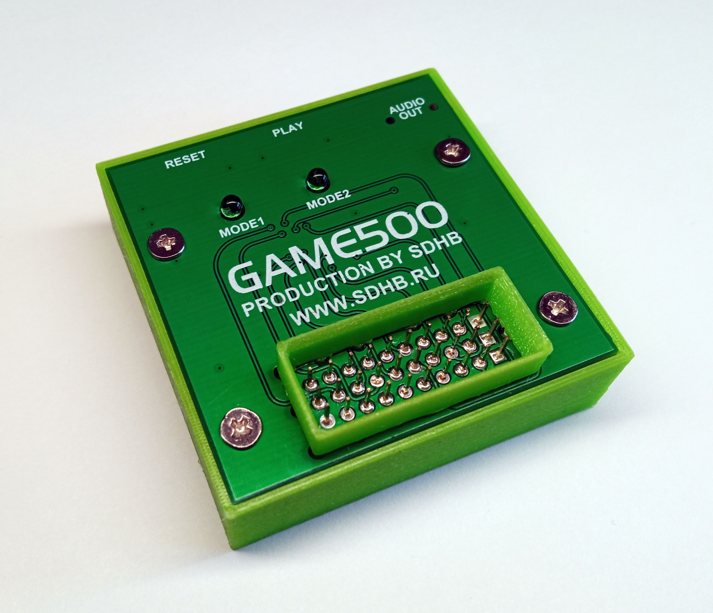

# GAME500

реяр

ROM cartridge for the Vector-06C computer

GAME500 is a simple device for quickly loading your favorite programs. The PU port is used to connect to the Vector, and if necessary,
the tape recorder input. GAME500 emulates a ROM cartridge, which is supported by most boot ROMs. If the Vector has a factory boot ROM without
ROM cartridge support, the GAME500 has an audio output that needs to be connected to the Vector's tape recorder connector.
When you press the "PLAY" button on the GAME500, a small bootloader program with ROM cartridge support is played from it.

Repository folder contents:
box - stl models of cartridge body parts.
doc - product documentation.
flash - program and files for preparing a bin file for writing to the W25Q128 flash memory.
gerber - GERBER files for the production of the printed circuit board.
hex - firmware file for the CH32V103C8T6 microcontroller.

